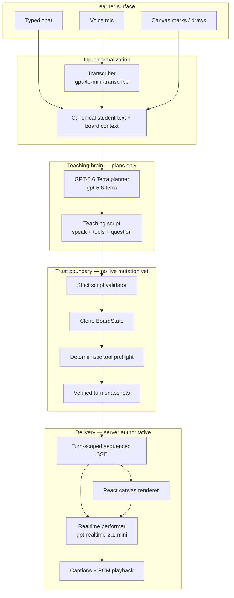
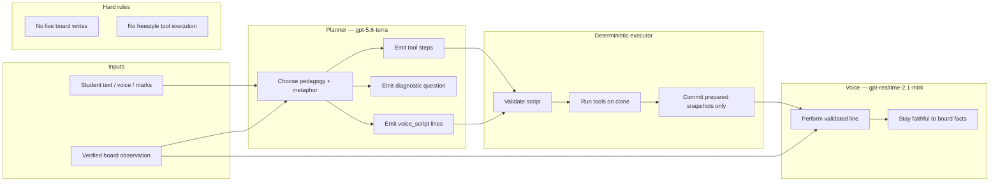
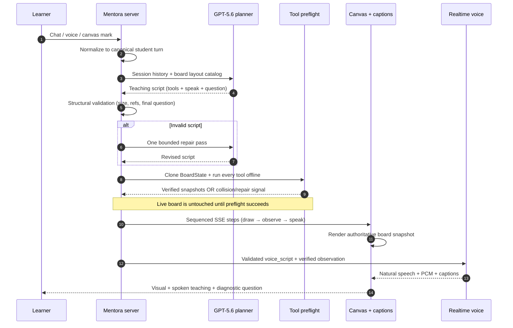
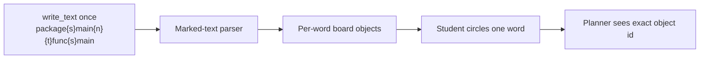
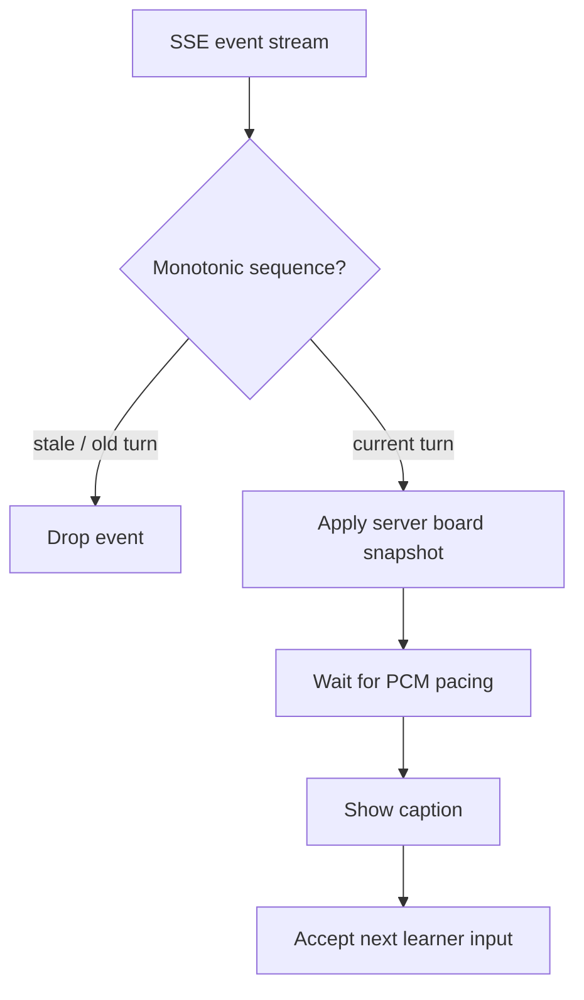
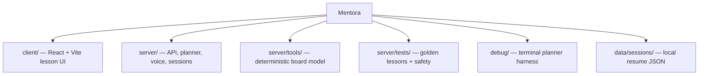
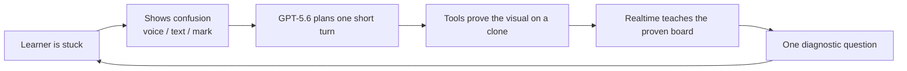

# Mentora Architecture

Mentora is a **voice-first visual teaching system** with a deliberate trust boundary:

> GPT-5.6 plans. Deterministic tools build. Validators verify. Realtime only performs.

The model never gets unchecked write access to the live board. That separation is the product.

---

## 1. System at a glance



**Why this shape wins:** planning intelligence is separated from board mutation and from spoken delivery. Each stage can fail safely without corrupting the learner’s canvas.

---

## 2. Three models, three jobs

The early failure mode was role bleed: planner and voice both tried to invent the lesson. Mentora forbids that.



| Role | Model | Allowed to do | Forbidden from doing |
| --- | --- | --- | --- |
| Transcriber | `gpt-4o-mini-transcribe` | Speech → text | Teaching, drawing, planning |
| Planner | `gpt-5.6-terra` | Write teaching script | Mutate live board, speak freely |
| Executor | Local TypeScript tools | Build/verify visuals | Invent pedagogy |
| Voice | `gpt-realtime-2.1-mini` | Speak validated lines | Plan lessons or invent board facts |

**The planner plans; the voice only performs.**

---

## 3. One teaching turn (trust boundary)

This is the critical engineering loop to show in the demo.



### What “clone-only preflight” protects against

- Off-canvas placements
- Broken object references
- Overlapping educational text without an intentional relationship
- Oversized / malformed scripts
- Voice inventing facts that are not on the board

If preflight cannot certify a turn, Mentora refuses to mutate the live canvas and falls back to a safe spoken recovery — **the invalid plan never reaches the learner’s board**.

---

## 4. Board tools and word-level precision

Mentora does not let the model “draw pixels.” It calls a narrow, tested tool set:

| Tool family | Examples | Job |
| --- | --- | --- |
| Structure | `create_shape`, `divide_region`, `place_relative` | Boxes, regions, layout |
| Language | `write_text`, `label_in` | Titles, code, equations |
| Attention | `highlight`, `point_at`, `arrow` | Focus and relationships |
| Edit | `erase_object`, `reset_board` | Clear space for the next idea |

### Word-level text expansion (marking precision)

A whole sentence as one object makes “hello **world**” ambiguous. Mentora expands text deterministically:



- `{s}` = space, `{n}` = newline, `{t}` = indent (JSON-safe marks)
- One tool call stays easy for the planner
- One word = one board object for the learner
- Circling `func` resolves to that word — not the whole line

This is pedagogy as systems design: **precision of attention requires precision of representation**.

---

## 5. Client reliability contract



The client is not an optimistic free-draw app during AI turns. It:

- trusts server board snapshots
- rejects stale turn events
- paces UI to spoken audio
- lets the learner interrupt with chat, voice, or canvas marks

---

## 6. Repository map



| Path | Responsibility |
| --- | --- |
| `client/` | Home + lesson UI, canvas, SSE consumer, voice queue |
| `server/src/teaching/` | Planner prompt, script validation, session orchestration |
| `server/tools/` | Board state, ten tools, layout inspection, text layout |
| `server/voice/` | Transcription, Realtime performer, turn playback |
| `server/tests/` | Offline verification + golden lesson regressions |
| `debug/` | Same production schema without the full UI |

Offline gate for judges:

```bash
npm run verify
```

---

## 7. Engineering principles (demo talking points)

1. **Separation of concerns as safety.** Planner ≠ executor ≠ voice.
2. **Clone-only mutation.** Live board changes only after verified snapshots exist.
3. **Narrow tool surface.** Ten tools beat unconstrained diagram generation for trust.
4. **Word-level board text.** Marking precision is implemented in the executor, not hoped for in the prompt.
5. **Fail closed.** Invalid or colliding scripts do not silently corrupt the canvas.
6. **Adaptive loop.** Every turn ends with one diagnostic question; the next turn reuses board + answer context.

---

## 8. End-to-end mental model



Mentora’s architecture is not “an LLM that draws.”  
It is a **verified teaching machine**: invent the explanation, build it safely, teach it out loud, check understanding, repeat.
