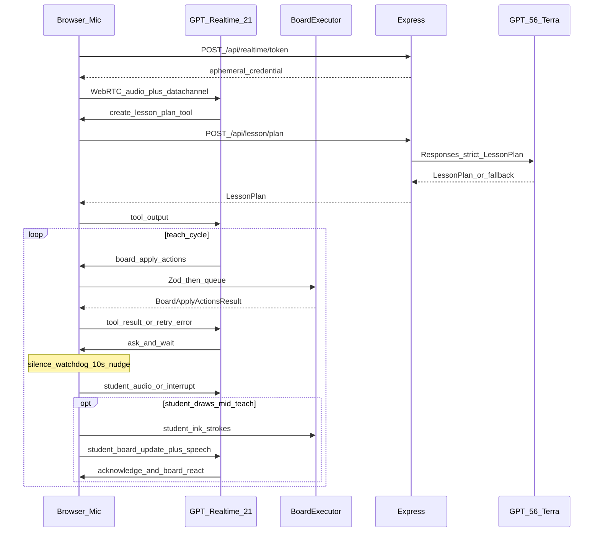

# Mentora — Architecture

Mentora is a voice-first AI teacher: the student speaks into the microphone, GPT-Realtime-2.1 teaches with natural speech-to-speech audio, and a shared whiteboard renders AI board actions plus student ink. GPT-5.6 Terra plans the lesson rarely; the application state machine keeps the session disciplined.

MVP ships one polished mathematics lesson:

```text
(a + b)² = a² + 2ab + b²
```

plus a prevalidated fallback plan so the demo always works.

---

## 1. Product boundaries

### Included

- Live microphone input (WebRTC)
- Natural AI voice output (Realtime speech-to-speech)
- Interruptible speech (semantic VAD + Stop AI)
- Digital whiteboard with AI-controlled tools **and student pen/ink**
- Mid-teaching voice + draw barge-in (student interrupts, draws, AI reacts)
- Lesson planning and adaptive teaching
- Session / runtime state (in-memory)
- One highly polished square-formula lesson
- Safe fallback lesson + Demo Safe Mode
- Phase 0 API smoke test
- Silence watchdog while waiting for the student
- Desktop web UI matching `example_UI/` comps (live lesson chrome, home, summary, settings)

### Excluded

- Camera input
- Accounts, payments, databases
- Teacher marketplace / full curriculum
- Mobile applications / phone-responsive layouts (comps may show mobile — ignore them)
- Long-term student profiles
- Custom-trained models
- Handwriting OCR / equation recognition from student strokes
- Separate STT + TTS pipelines
- Microservices, message brokers, Redis

---

## 2. Exactly two AI models

| Model | Role | Env | Call frequency |
|-------|------|-----|----------------|
| **GPT-Realtime-2.1** | Live teacher: audio in/out, interruption, classification, tool calls, conduct plan | `OPENAI_REALTIME_MODEL=gpt-realtime-2.1` | Continuous WebRTC session |
| **GPT-5.6 Terra** | Pedagogical planner: LessonPlan, misconceptions, hints, replan, optional summary | `OPENAI_PLANNER_MODEL=gpt-5.6-terra` | Start once; replan only when needed; optional end |

**Do not use unsuffixed `gpt-5.6`.** That alias routes to expensive Sol. Terra supports Responses API structured outputs.

Realtime must not invent the entire lesson every turn. It executes the structured plan supplied by Terra (or the cached fallback).

---

## 3. High-level system

```text
┌─────────────────────────────────────────────────────────────┐
│                        Browser Client                       │
│  Microphone (WebRTC)   Shared Whiteboard (AI + student ink) │
│         │                         ▲                         │
│         ▼                         │                         │
│  GPT-Realtime-2.1 session    Whiteboard Tool Executor       │
│  Voice + VAD + Tools  ──────► Zod validate → action queue   │
│         ▲◄──── student_board_update (ink summary) ──────────│
└─────────────────────────┬───────────────────────────────────┘
                          │ tool forwards (plan/replan)
                          ▼
┌─────────────────────────────────────────────────────────────┐
│                     Application Server                      │
│  POST /api/realtime/token                                   │
│  POST /api/lesson/plan | replan | summary                   │
│  GPT-5.6 Terra planner (Responses + strict JSON schema)     │
│  OPENAI_API_KEY stays here only                             │
└─────────────────────────────────────────────────────────────┘
```



---

## 4. Technology stack

| Layer | Choices |
|-------|---------|
| Frontend | React, TypeScript, Vite, Zustand, Konva.js, KaTeX, native WebRTC, Zod |
| Backend | Node.js, Express, OpenAI JS SDK, Zod |
| Storage | In-memory session state only |
| Run | One command: `npm run dev` (Express + Vite) |

---

## 5. Realtime connection

1. Student starts a lesson → browser requests microphone permission.
2. Browser calls `POST /api/realtime/token`.
3. Server uses `OPENAI_API_KEY` to mint an ephemeral client secret (`POST /v1/realtime/client_secrets`), sets `OpenAI-Safety-Identifier`, returns `{ value, expiresAt? }`.
4. Browser creates `RTCPeerConnection`, attaches mic track + remote audio + data channel, POSTs SDP to `/v1/realtime/calls` with the ephemeral token.
5. Session is configured with Mentora instructions, tools, and runtime summary.

### Required GA session config

```ts
{
  type: "realtime",
  model: "gpt-realtime-2.1",
  reasoning: { effort: "low" },
  output_modalities: ["audio"],
  audio: {
    input: {
      turn_detection: {
        type: "semantic_vad",
        eagerness: "low",
        create_response: true,
        interrupt_response: true
      }
    },
    output: { voice: "marin" }
  }
}
```

Voice must be selected before the first audio response. Prompt rule: speak at most one or two short sentences before the corresponding visual tool call.

---

## 6. Planner (Terra) cadence

1. Once when the lesson begins (`create_lesson_plan` → `POST /api/lesson/plan`).
2. Again only when replanning is genuinely required (`replan_lesson`).
3. Optionally once for the final summary.

During planning, Realtime may say a short filler (“Sure—let me prepare a visual explanation”) so the student is not left in silence.

Planner failures: retry once → load `fallbackSquareLesson` → continue.

---

## 7. Tools

Realtime supports function calling but **not guaranteed Structured Outputs**. Every tool argument batch is Zod-validated. Malformed calls are rejected (no partial execution); a structured error is returned; the model is asked to retry.

| Tool | Purpose |
|------|---------|
| `board_apply_actions` | Batch of board actions → queue → result |
| `create_lesson_plan` | Forward to Terra planner |
| `replan_lesson` | Forward to Terra replan |
| `update_lesson_state` | Phase / step / understanding / misconceptions |
| `complete_lesson` | Mastery flags + final feedback |

Schemas require every declared property, `additionalProperties: false`, stable object IDs, and rejection of unknown board action types.

---

## 8. Whiteboard engine

The AI never draws raw pixels for structured teaching visuals. Pipeline:

```text
Realtime tool call → Zod validate complete batch → action queue
  → execute → await animation (blocking actions only) → tool result
```

The student **does** draw freehand pixels/ink on a separate layer. That ink is first-class input, not decoration.

### Layers

| Layer | Writer | Contents |
|-------|--------|----------|
| `ai` | Realtime via `board_apply_actions` | Structured objects (shapes, equations, labels) |
| `student` | Pointer/touch pen UI | Freehand strokes with stable IDs (`student_stroke_*`) |

### Board object

AI objects live in a registry by ID: text, equation, rectangle, circle, line, arrow, label, highlight — with geometry, latex/text, visibility, and metadata. Student strokes are registered separately but addressable (`point_at` / erase by `student_*` id).

### Action classes

**Blocking (sequential mutations):**  
`draw_rectangle`, `draw_circle`, `draw_line`, `draw_arrow`, `write_text`, `write_equation`, `move_object`, `erase_object`, `clear_board`, `pause`  
Draw tweens typically 300–800 ms. Never run two mutations simultaneously.

**Non-blocking focus (may overlap speech):**  
`point_at`, `highlight` — start immediately; auto-clear after `holdMs` TTL or via `clear_focus`. They must not stall the mutation queue or delay tool-result return for the full hold duration.

Rules:

- Do not allow references to objects before creation.
- Reject duplicate IDs.
- Prefer ID references over coordinates when pointing/highlighting.
- On interrupt: keep already-drawn AI objects **and** student ink; drop unstarted queued mutations; mark sequence incomplete.
- Missing target → `{ success: false, error: "OBJECT_NOT_FOUND", objectId, availableObjectIds }`.
- AI may annotate relative to student stroke IDs; do not silently wipe student ink without acknowledging (prefer `clear_student_layer` or targeted erase after explaining).

### Student board co-interaction

Canonical path: AI teaching → student says *“Hey wait — what if I do it like this?”* → student draws → client sends `student_board_update` → AI acknowledges and reacts (voice + optional board actions).

`student_board_update` (client → Realtime, not a model tool): stroke IDs, bounds, stroke count, nearest AI object IDs, optional intent hint (`attempting_answer` | `showing_idea` | `annotating` | `unknown`). No handwriting OCR in MVP — Realtime reasons from speech + this geometry summary.

Pen UI: pen / eraser / clear-my-ink. Available during `teaching`, `asking`, `waiting_for_student`, and interrupts. While `studentBoardActive`, pause the silence watchdog.

---

## 9. Voice ↔ board synchronization

Word-level sync is not required. Pattern:

```text
AI speaks short intent → board_apply_actions → board finishes
  → AI explains while pointer/highlight is active (non-blocking)
  → AI asks one question → wait
```

Student co-draw may interrupt that pattern at any point; after acknowledge/react, resume the step or remediate.

---

## 10. Interruption

### Voice barge-in

With `interrupt_response: true` and semantic VAD:

1. Student speech detected while AI is talking.
2. Realtime output cancelled; unplayed audio discarded.
3. Current board animation paused or completed safely; unstarted actions dropped.
4. Runtime sets `wasInterrupted = true`.
5. Student utterance processed; AI answers; resume or modify lesson.

### Voice + whiteboard barge-in

Same cancel/drop rules, plus:

1. Student may speak and draw in one turn.
2. Keep student ink; inject `student_board_update` into the Realtime session.
3. AI must respond to **both** speech and board context — not ignore the drawing.
4. AI may then `board_apply_actions` to point at student strokes, correct nearby, or continue after acknowledging.

UI: **Stop AI**, **Mute microphone**, **Restart session**, **Pen / Eraser / Clear my ink**.

---

## 11. Lesson plan and runtime state

**LessonPlan** describes what should happen: prerequisites, misconceptions, objectives, steps (strategy, boardPlan, checkQuestion, acceptedAnswers, hintLadder, fallbackExplanation), final assessment, mastery criteria.

**LessonRuntimeState** records what is happening: phase, current/completed steps, understanding estimate (0–1, not a validated psychometrics score), hint level, misconceptions, Q&A records, speaking/interrupt flags, AI board object IDs, student stroke IDs, `studentBoardActive`, timestamps.

**StudentBoardUpdate** — compact stroke summary injected into the live session.

### Teaching phases

```text
idle → understanding_request → planning → diagnosing → teaching
  → asking → waiting_for_student → evaluating
       ├── correct → advance
       ├── partial → small hint
       ├── incorrect → targeted correction
       ├── does_not_know → progressive hints
       ├── misconception → remediate / maybe replan
       ├── student_visual_attempt → acknowledge ink + adapt
       └── off_topic → brief answer, return
  → assessing → complete | remediating → teaching
```

Mid-teach overlay: `teaching | asking` → interrupt (speech and/or student ink) → brief evaluate/acknowledge → resume teaching or remediate.

Hard rules:

- Never leave `waiting_for_student` until actual student speech, student board activity, or Stop/Restart.
- Do not answer your own question.
- Do not say “correct” unless the answer is actually correct.

### Silence watchdog

While phase is `waiting_for_student`, if no student speech for **8–12 seconds** (default **10s**):

1. First silence → one gentle nudge (“Take your time…” / Realtime reminder).
2. Second silence → optional light hint or “Still thinking?”
3. Never auto-credit a correct answer; never deadlock the wait state.
4. Suspend while the student is actively drawing (`studentBoardActive`).

### Response classification

```ts
type StudentResponseClassification =
  | "correct_with_understanding"
  | "correct_with_hint"
  | "partially_correct"
  | "incorrect_calculation"
  | "incorrect_concept"
  | "missing_prerequisite"
  | "does_not_know"
  | "off_topic"
  | "unclear_audio"
  | "student_visual_attempt";
```

Realtime classifies immediately. Call Terra only when uncertain, when a complicated misconception appears, after two failed remediations, or when strategy must change.

---

## 12. State ownership

| Owner | Owns |
|-------|------|
| Browser | AI board + student ink, animation queue, WebRTC, mic, pen UI, UI phase, runtime state, tool results, `student_board_update`, silence timer |
| GPT-Realtime-2.1 | Spoken conversation, immediate decisions, classification (incl. visual attempt), next action, whiteboard tool calls, react to student ink |
| Backend | Permanent API key, ephemeral tokens, Terra requests, validation, light logging |
| GPT-5.6 Terra | Initial lesson structure, misconception strategy, hint ladders, replan, optional summary |
| Application state machine | Runtime truth, phase discipline, silence watchdog |

---

## 13. Backend API

| Endpoint | Responsibility |
|----------|----------------|
| `POST /api/realtime/token` | Ephemeral Realtime credentials |
| `POST /api/lesson/plan` | Terra → structured LessonPlan; retry; fallback |
| `POST /api/lesson/replan` | Replace remaining steps; preserve completed |
| `POST /api/lesson/summary` | Optional concepts understood/weak + next lesson |

---

## 14. Demo Safe Mode

`VITE_DEMO_SAFE_MODE=true`:

- Use prevalidated `fallbackSquareLesson` (no live Terra plan during recorded demo).
- Keep Realtime voice, evaluation, and board tools live.
- At most one controlled replan.
- Instant lesson reset.
- Hide developer chrome in the recorded UI.

---

## 15. Cost and failure controls

- One lesson plan per session; cache the square-formula plan.
- Replan only after repeated confusion.
- Send compact runtime summaries to Terra, not raw event logs.
- Hard maximum lesson duration; end inactive sessions.
- Realtime reconnect preserves board + runtime; mint a new token; inject a compact session summary.
- API budget pressure → Demo Safe Mode + optional dev-only cost counter.

---

## 16. Square-formula lesson (visual contract)

1. Draw one large square.
2. Label horizontal and vertical sides `a + b`.
3. Ask how to calculate the entire area; wait.
4. Divide lengths into `a` and `b`; draw internal lines.
5. Label regions: `a²`, `ab`, `ab`, `b²`.
6. Point at both `ab` rectangles; combine visually into `2ab`.
7. Write the completed identity.
8. Ask why the middle term is `2ab`.
9. Ask one transfer question (different symbols or numbers).

Adaptive branches: correct (praise + advance), partial (confirm + follow-up), incorrect (no automatic “almost”; point + simpler question), “I don’t know” (reassure + hint ladder), voice interruption (stop, address, resume), **student draws mid-teach** (acknowledge ink + speech, react on board, resume or remediate).

Region labels must be algebraically correct — a labeling bug is disproportionately damaging in front of judges.

---

## 17. UI/UX (desktop web) — from `example_UI/`

**References:** `example_UI/exampleUIUX1.png` (primary live-lesson chrome); `example_UI/exampleUIUX2.png` (multi-page composite: home, topics, voice states, summary, settings). **Ignore mobile frames.**

**Platform:** desktop web only (~1280×720+). Dark charcoal surfaces; neon blue/purple/cyan/pink accents; Mentora robot avatar; glass cards + glow on active tools/mic — match comps.

### Screens

| Screen | MVP |
|--------|-----|
| Home | Left nav; welcome; ask Mentora; recent topics → start square lesson |
| Lessons / Topics | Light list; live entry = Expanding `(a+b)²`; others may be placeholders |
| Live lesson | Hero screen — match exampleUIUX1 zones |
| Lesson summary | Understanding %, questions, hints, what you learned |
| Settings | Voice (Marin), speed, hints level, sound, dark mode |
| Stats | Stub ok |

### Live lesson composition

```text
Top: Mentora | exit | Live lesson badge | title | Stop lesson
Left rail: pointer, pen, shapes, text, equation, eraser, undo, reset
Center: dominant shared whiteboard (AI objects + student ink)
Right: avatar + waveform, Teaching•Live, Progress|Transcript|Notes,
       step checklist, understanding gauge, time · questions
Bottom: Ask anything… | Listening waveform | Mic | Send
```

Voice status chips (required): Thinking / Speaking / Waiting / Listening — map from runtime/Realtime state. Progress checklist tracks lesson steps. Live lesson must be recognizable against `exampleUIUX1` at a glance.

---

## 18. Repository layout

```text
example_UI/          # design comps (reference)
client/src/
  app/               # routes
  styles/            # tokens from comps
  pages/             # Home, Lessons, LiveLesson, Summary, Settings
  realtime/          # WebRTC client, session, events, tools, instructions, interruption
  board/             # Konva canvas, registry, executor, queue, student ink, laser, KaTeX, schemas
  teaching/          # plan/runtime schemas, state machine, fallback, mastery, silence, studentBoardBridge
  state/             # Zustand stores (session, board, ui)
  components/
    layout/          # AppShell, LeftNav
    lesson/          # TopLessonBar, BoardToolRail, MentoraSidebar, VoiceDock, …
    home/ summary/ shared/
  api/
server/
  routes/            # token, plan, replan, summary
  services/          # openaiRealtime, openaiPlanner
  scripts/smoke.ts   # Phase 0
  prompts/
  validation/
shared/
  lesson.ts
  board.ts
  realtime.ts
```

Root: `ARCHITECTURE.md`, `TASKS.md`, `README.md`, `.env.example`, npm workspaces, `npm run dev`, `npm run smoke`.

---

## 19. Final architectural rule

```text
GPT-Realtime-2.1  = live voice teacher + immediate controller
GPT-5.6 Terra     = lesson planner + difficult-case replanner
Whiteboard engine = shared visual surface (AI actions + student ink)
Application SM    = source of runtime truth (+ silence watchdog + co-draw interrupt)
```

Do not build four independent agents. The AI provides intelligence; the state machine provides discipline; the shared whiteboard provides visual teaching; Realtime provides human-like interaction.

---

## 20. Pitch framing

The single lesson is a deliberate bet, not a limitation: deep investment in the interaction model. The board-action contract and LessonPlan schema are topic-agnostic — a new lesson is a plan/script, not a product rewrite.
