# Mentora

Mentora is a voice-first visual AI tutor for beginners who are stuck in a
loop of receiving more text when they need a concrete visual model.

Instead of retrieving a static diagram, Mentora uses GPT-5.6 to plan a short
teaching turn around the learner's current question, constructs the visual
with deterministic board tools, verifies the resulting board state, and
performs the explanation with Realtime voice.

## What it demonstrates

The strongest current experience is foundational instruction that can be
expressed with boxes, labels, equations, highlights, and simple shapes:

- Python variables shown as labelled containers;
- fractions shown as equal regions;
- basic arithmetic and algebra shown as short equations;
- simple process or geometry diagrams.

Each turn ends with one diagnostic question. A later answer is included in
the planner context so the next turn can reuse the board and address the
learner's response.

## Architecture

```mermaid
flowchart LR
  Input[Typed chat or recorded voice] --> Canonical[Canonical student text]
  Canonical --> Session[TeachingSession and current BoardState]
  Session --> Planner[GPT-5.6 teaching planner]
  Planner --> Validator[Strict script validation]
  Validator --> Preflight[Clone-only tool preflight]
  Preflight --> SSE[Sequenced turn-scoped SSE]
  SSE --> Canvas[Deterministic canvas]
  SSE --> Realtime[Realtime voice performer]
  Canvas --> Observation[Verified board observation]
  Observation --> Realtime
  Realtime --> Captions[PCM playback and captions]
```



The runtime keeps responsibilities deliberately narrow:

- **GPT-5.6 planner:** chooses the teaching strategy, visual metaphor,
  sequence, object references, and final diagnostic question.
- **Local validator:** rejects malformed, oversized, reference-invalid, or
  unsafe scripts before visible state changes.
- **Ten deterministic tools:** create, divide, label, position, highlight,
  point, arrow, write, erase, and reset board objects.
- **Prepared-turn executor:** runs tools against a clone and stores verified
  snapshots. Live state only receives a prepared snapshot from the current
  turn.
- **Realtime performer:** performs the exact validated teaching line against
  verified board context. It does not invent lesson content or board facts.
- **Client:** consumes monotonically sequenced events, waits for PCM playback,
  rejects stale turns, and renders server-authoritative board snapshots.

## Reliability boundaries

Mentora is intentionally narrow for this build. It is demo-safe for beginner
variables, fractions, and simple arithmetic. It can also support simple
geometry and process diagrams when they fit the existing primitives.

It does **not** currently promise:

- dense biology diagrams, graph plotting, curves, or rich LaTeX;
- advanced mathematical notation or proof layout;
- multi-user accounts, cloud sync, or classroom management;
- guaranteed quality for arbitrary open-ended or non-visual topics.

Learning sessions persist locally as JSON under `data/sessions/` so you can
resume a lesson from the home page after a server restart. There are no user
accounts; files live on the machine running the server.

## Run locally

Requirements:

- Node.js 20 or newer;
- an OpenAI API key for live planning, transcription, and voice;
- a modern browser with Web Audio and microphone support for voice input.

Install all three packages:

```bash
npm run install:all
```

Copy the environment template:

```bash
cp .env.example .env
```

On Windows PowerShell:

```powershell
Copy-Item .env.example .env
```

Set `OPENAI_API_KEY` in `.env`, then start the server:

```bash
npm run server
```

In another terminal, start the client:

```bash
npm run client
```

Open `http://localhost:5173`. The API listens on
`http://localhost:3001` by default.

The home page lists previous learning sessions and a centered prompt
(“Let’s learn something new today!”). Submitting a prompt opens a new
interactive lesson; clicking a past session resumes its board and transcript.

The microphone starts muted. Click it once to enable recording. Typed input
uses the same planner, validation, canvas, and voice pipeline.

## Offline verification

No paid provider call is made by automated verification:

```bash
npm run verify
```

This command runs:

1. TypeScript checks for `server`, `client`, and `debug`;
2. Vitest suites for parser constraints, all board tools, prepared turns,
   cancellation, SSE ordering, the client turn reducer, and golden lessons;
3. production builds for the server and client.

The three golden fixtures are Python variables with a mocked adaptive second
turn, a four-part fraction bar, and simple arithmetic. They prove deterministic
orchestration and state reuse; they do not claim that every live model run is
identical.

## Codex development story

Codex was used as an engineering partner rather than as a code generator for
one isolated feature. It helped:

1. trace the real voice/planner/tool/canvas path and identify drift between the
   production and debug contracts;
2. reproduce an off-canvas `place_relative` defect and a 13-step script that
   bypassed the intended limit;
3. replace partial mutation with strict validation and clone-only preflight;
4. design deterministic regression fixtures for variables, fractions, and
   arithmetic;
5. add turn-scoped cancellation, stale-event filtering, and audio-aware event
   ordering;
6. audit the judge-facing UI and remove internal observation metadata.

Session resume and a small arrow tool were added after the core teaching loop
was stable. The submission still focuses on generated visual pedagogy within a
tested primitive set rather than unconstrained diagram generation.

The required Codex `/feedback` Session ID must be entered in the Build Week
submission form after the final development session.

## Repository layout

- `client/` — React/Vite home + lesson UI, canvas, SSE consumer, PCM queue;
- `server/` — HTTP API, planner, validation, session orchestration, voice;
- `server/tools/` — deterministic board model and ten tool definitions;
- `server/tests/` — offline safety and golden-lesson regression suite;
- `data/sessions/` — local persisted lesson JSON (gitignored runtime data);
- `debug/` — terminal planner harness using the production prompt and schema;
- `REHEARSAL_RESULTS.md` — approved nine-run live planner/tool measurements;
- `SUBMISSION.md` — recording script, Devpost copy, and final external checklist.

## Submission assets

The final public video URL and screenshot/GIF should be added here after upload.
The recording plan and copy are ready in [SUBMISSION.md](SUBMISSION.md).

## License

Copyright © 2026 Mentora. All rights reserved. See [LICENSE](LICENSE).
